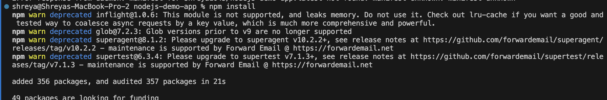
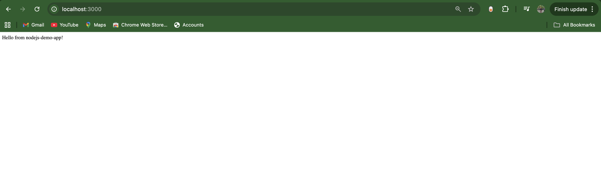
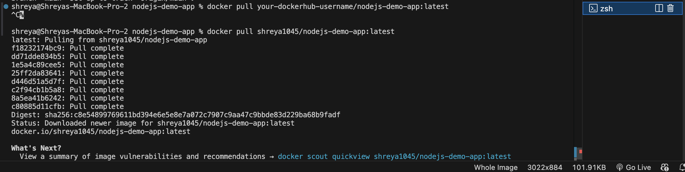
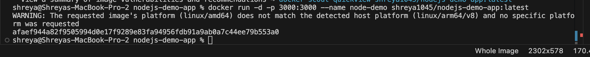
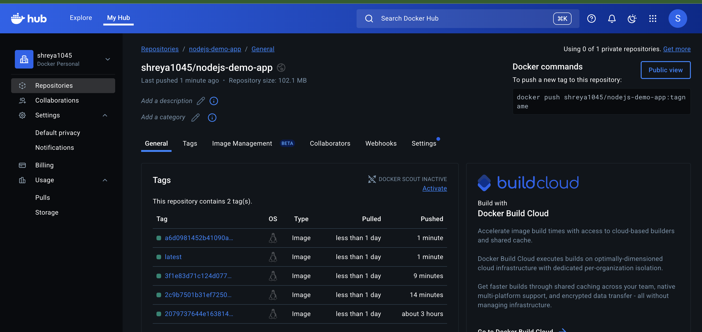

# Node.js Demo App

A lightweight Node.js web application demonstrating CI/CD automation using GitHub Actions and Docker.  
This project includes step-by-step setup, testing, Dockerization, and CI/CD deployment.

---

## Project Overview

- Express.js server
- Jest tests
- Dockerized app
- Automated CI/CD pipeline (GitHub Actions → DockerHub)
- Step-by-step instructions with screenshots

---

## 1. Clone the Repository

```bash
git clone https://github.com/shreya123688/nodejs-demo-app.git
cd nodejs-demo-app
```
## 2. Install Dependencies
```
npm install
```

## 3. Run Tests
```
npm test
```

## 4. Start the Server Locally
```
npm start
```
Server will run at http://localhost:3000.

```
```
## 5. Dockerize the App
```
docker build -t <your-dockerhub-username>/nodejs-demo-app:latest .
```

Run Docker Container
```
docker run -d -p 3000:3000 <your-dockerhub-username>/nodejs-demo-app:latest
```

## 6. CI/CD with GitHub Actions

Workflow file: .github/workflows/main.yml

Triggered on push to main

Steps:

1. Checkout repo

2. Install dependencies

3. Run tests

4. Build Docker image

5. Push image to DockerHub

## 7. GitHub Secrets Required

DOCKERHUB_USERNAME — DockerHub username

DOCKERHUB_TOKEN — DockerHub access token
## Notes

Always commit package-lock.json for consistent builds with npm ci

Tests must be inside tests/ folder with .test.js extension

.gitignore includes node_modules/ to avoid committing dependencies

Replace <your-dockerhub-username> with your actual DockerHub username
